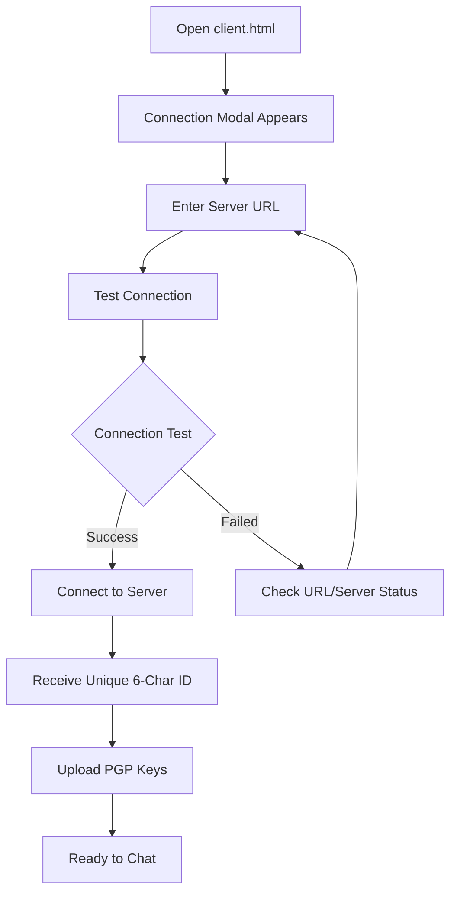
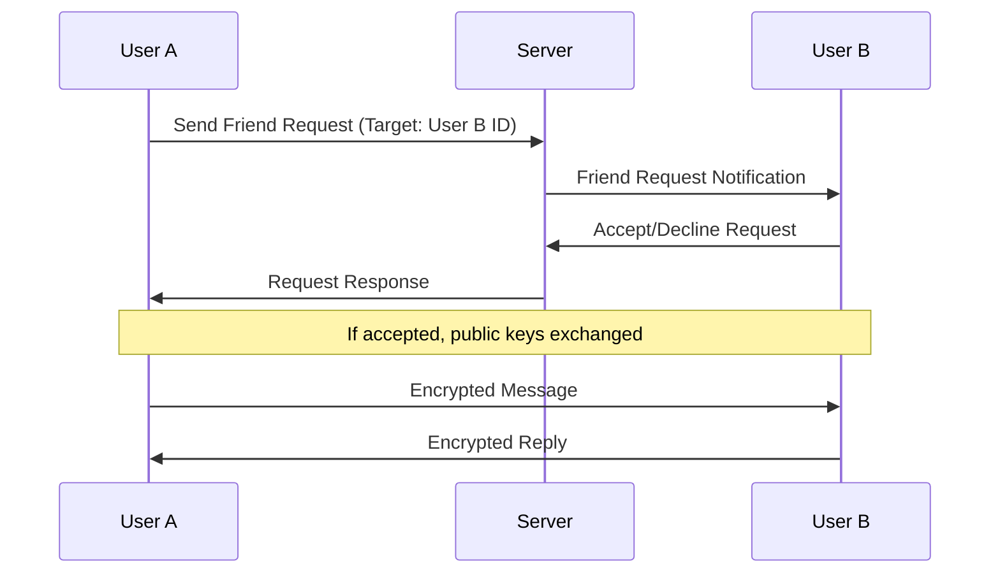
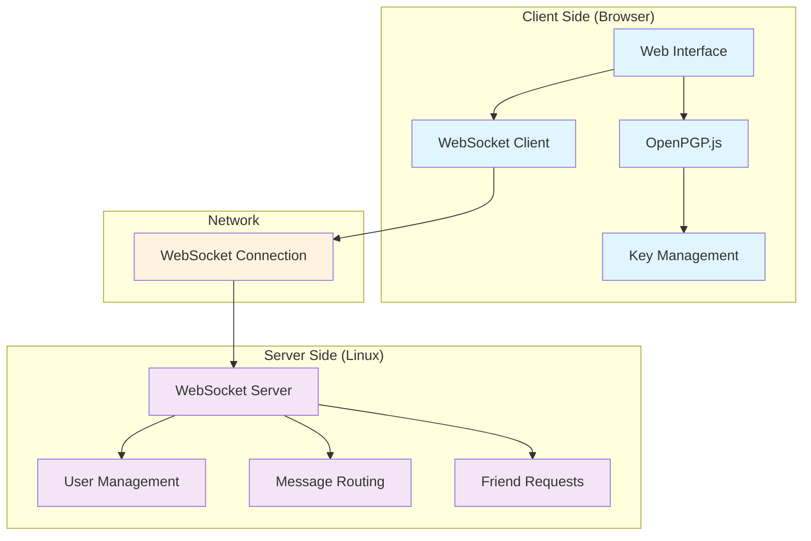

# xsukax PGP Secure Chat

A privacy-focused, end-to-end encrypted chat application that prioritizes security and user anonymity through military-grade PGP encryption and decentralized architecture.

## Project Overview

xsukax PGP Secure Chat is a minimalist, secure messaging platform designed for users who prioritize privacy and security above all else. The application implements true end-to-end encryption using PGP (Pretty Good Privacy) standards, ensuring that even the server cannot decrypt or access message contents.

The system consists of a lightweight Python WebSocket server and a sophisticated web-based client that handles all encryption operations locally in the browser. Users are identified by randomly generated 6-character IDs, eliminating the need for personal information or account registration.

**Key Characteristics:**
- **Zero-knowledge architecture**: Server never sees unencrypted message content
- **Browser-based encryption**: All cryptographic operations performed client-side
- **Minimal metadata exposure**: No tracking of online status or user behavior
- **Direct peer-to-peer communication**: Friend-to-friend messaging model
- **Cross-platform compatibility**: Works on any device with a modern web browser

## Security and Privacy Benefits

### End-to-End Encryption
- **PGP Implementation**: Utilizes OpenPGP.js (version 5.10.2) for industry-standard encryption
- **Client-side Processing**: All encryption/decryption occurs in the browser before network transmission
- **Perfect Forward Secrecy**: Each message is individually encrypted with the recipient's public key
- **Cryptographic Integrity**: Messages cannot be tampered with or forged in transit

### Privacy Protection
- **Anonymous Identity System**: Users identified only by random 6-character IDs
- **No Personal Data Collection**: No email addresses, phone numbers, or personal information required
- **Invisible Presence**: No online status indicators or last-seen timestamps
- **Minimal Metadata**: Server only routes encrypted messages without content access
- **Local Key Management**: PGP keys stored and managed entirely on user devices

### Infrastructure Security
- **Decentralized Design**: No reliance on third-party services or cloud providers
- **Self-hosted Capability**: Complete control over server infrastructure
- **Minimal Attack Surface**: Simple WebSocket server with limited functionality
- **Transport Security**: Support for both WS and WSS (TLS) connections
- **Isolated Sessions**: No persistent user profiles or stored credentials

### Network Security
- **Direct WebSocket Communication**: No intermediate proxies or relays
- **Optional TLS Encryption**: Additional transport layer security available
- **Connection Validation**: Built-in connection testing before establishing sessions
- **Automatic Reconnection**: Resilient connection handling with error recovery

## Features and Advantages

### Core Functionality
- **Instant Messaging**: Real-time encrypted communication between friends
- **Friend Request System**: Secure method to establish trusted connections
- **Cross-Platform Client**: Single HTML file works on any modern browser
- **Responsive Design**: Mobile-friendly interface with adaptive layout
- **Dark Theme**: Professional, eye-friendly interface optimized for extended use

### Technical Advantages
- **No Installation Required**: Client runs directly in web browser
- **Minimal Dependencies**: Server requires only Python 3 and websockets library
- **High Performance**: Lightweight architecture with efficient message routing
- **Scalable Design**: Can handle multiple concurrent users with minimal resources
- **Easy Deployment**: Simple installation script for Linux servers

### User Experience
- **Intuitive Interface**: Clean, hacker-inspired design with clear navigation
- **One-Click ID Copying**: Easy sharing of user identifiers
- **File-based Key Import**: Simple PGP key management through file upload
- **Real-time Connection Testing**: Verify server connectivity before connecting
- **Comprehensive Error Handling**: Clear feedback for all user actions

### Administrative Features
- **System Service Integration**: Automatic startup and management on Linux systems
- **Comprehensive Logging**: Detailed server logs for monitoring and debugging
- **Firewall Configuration**: Automatic port configuration during installation
- **Service Management**: Standard systemd commands for server control

## Installation Instructions

### Prerequisites
- **Server**: Linux system (Debian/Ubuntu/CentOS/RHEL/Rocky/AlmaLinux)
- **Client**: Modern web browser with JavaScript enabled
- **Network**: Open port 8765 (or custom port) for WebSocket connections

### Server Installation

#### Automated Installation
1. **Download the installation script**:
   ```bash
   git clone https://github.com/xsukax/xsukax-PGP-Secure-Chat.git
   cd xsukax-PGP-Secure-Chat
   chmod +x install_service.sh
   ```

2. **Run the installation**:
   ```bash
   sudo ./install_service.sh install
   ```

3. **Verify installation**:
   ```bash
   sudo systemctl status xsukax-pgp-chat
   ```

#### Manual Installation
1. **Install dependencies**:
   ```bash
   # Debian/Ubuntu
   sudo apt update && sudo apt install -y python3 python3-pip
   
   # CentOS/RHEL
   sudo yum install -y python3 python3-pip
   ```

2. **Install Python packages**:
   ```bash
   pip3 install websockets asyncio
   ```

3. **Deploy server**:
   ```bash
   sudo mkdir -p /opt/xsukax-pgp-chat
   sudo cp server.py /opt/xsukax-pgp-chat/
   sudo chmod +x /opt/xsukax-pgp-chat/server.py
   ```

4. **Create systemd service** (optional):
   ```bash
   sudo ./install_service.sh install
   ```

### Client Setup
1. **Download the client**:
   ```bash
   wget https://raw.githubusercontent.com/xsukax/xsukax-PGP-Secure-Chat/refs/heads/main/Client.html
   ```

2. **Open in browser**:
   - Double-click `Client.html` or
   - Open directly in your preferred web browser

### PGP Key Generation
Generate your PGP key pair using GPG:

```bash
# Generate new key pair
gpg --full-generate-key

# Export public key
gpg --armor --export YOUR_KEY_ID > public_key.asc

# Export private key
gpg --armor --export-secret-keys YOUR_KEY_ID > private_key.asc
```

## Usage Guide

### Initial Setup



### Establishing Connections



### Daily Workflow

1. **Connect to Server**:
   - Open `Client.html` in browser
   - Enter server URL (e.g., `ws://your-server.com:8765`)
   - Test and establish connection
   - Note your assigned 6-character ID

2. **Key Management**:
   - Upload your private key (.asc or .gpg file)
   - Upload your public key (.asc or .gpg file)
   - Keys are processed locally and never transmitted

3. **Adding Friends**:
   - Obtain friend's 6-character ID through secure channel
   - Enter ID and send friend request
   - Wait for acceptance notification

4. **Secure Messaging**:
   - Select friend from list
   - Type message in input area
   - Messages automatically encrypted before transmission
   - View decrypted messages in chat area

### Server Management

```bash
# Start service
sudo systemctl start xsukax-pgp-chat

# Stop service
sudo systemctl stop xsukax-pgp-chat

# Restart service
sudo systemctl restart xsukax-pgp-chat

# View status
sudo systemctl status xsukax-pgp-chat

# View logs
sudo journalctl -u xsukax-pgp-chat -f

# Uninstall completely
sudo ./install_service.sh uninstall
```

### Security Best Practices

1. **Key Security**:
   - Generate keys on trusted, offline systems
   - Use strong passphrases for private keys
   - Store backup copies in secure locations
   - Never share private keys

2. **Communication Security**:
   - Verify friend IDs through secure channels
   - Use WSS (TLS) connections when possible
   - Regularly update client and server software
   - Monitor server logs for suspicious activity

3. **Operational Security**:
   - Access chat only from trusted devices
   - Clear browser cache after sensitive conversations
   - Use VPN or Tor for additional anonymity
   - Implement server firewall rules appropriately

### Troubleshooting

| Issue | Solution |
|-------|----------|
| Connection Failed | Check server URL, firewall settings, and server status |
| Key Upload Error | Verify file format (.asc/.gpg) and key validity |
| Decryption Failed | Ensure correct private key is loaded |
| Friend Request Failed | Verify target ID exists and is online |
| Service Won't Start | Check logs with `journalctl -u xsukax-pgp-chat` |

## System Architecture



## Licensing Information

This project is licensed under the **GNU General Public License v3.0** (GPL-3.0).

### What this means:

**For Users:**
- You are free to use, modify, and distribute this software
- You can use it for personal or commercial purposes
- No warranty is provided - use at your own risk
- You must preserve copyright and license notices

**For Contributors:**
- Any modifications or derivative works must also be licensed under GPL-3.0
- Source code must be made available when distributing the software
- You must document any changes made to the original code
- Patent rights are automatically granted to users

**For Distributors:**
- You must provide source code alongside any distributed binaries
- You must include the full license text
- You cannot impose additional restrictions beyond those in GPL-3.0
- You must make recipients aware of their rights under the license

The GPL-3.0 ensures that this software remains free and open-source, protecting user freedoms while encouraging collaborative development and improvement.

For the complete license text, see the [LICENSE](LICENSE) file in this repository or visit: https://www.gnu.org/licenses/gpl-3.0.html

---

**Note**: This software implements cryptographic functionality. Please verify compliance with your local laws regarding the use and distribution of encryption software before deployment.
