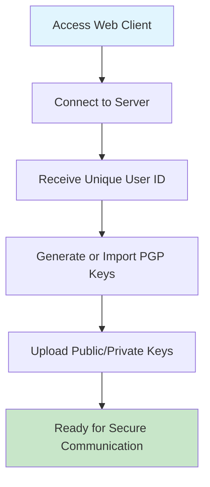
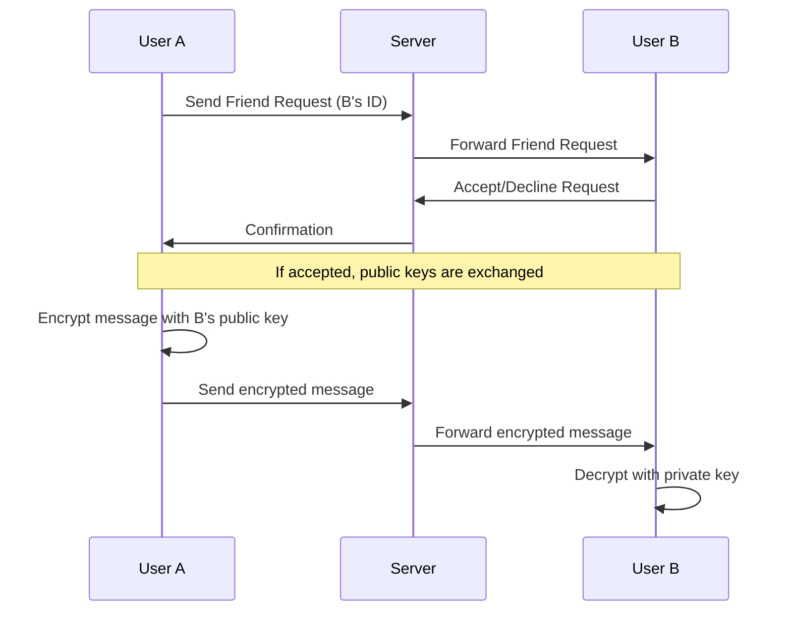
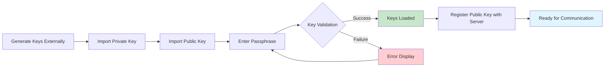

# xsukax PGP Secure Chat

A lightweight, privacy-focused real-time chat application that implements end-to-end encryption using OpenPGP standards. Built with security and user privacy as core principles, this application ensures that your conversations remain completely private and secure.

## Project Overview

xsukax PGP Secure Chat is a modern web-based messaging platform that combines the proven security of PGP encryption with the convenience of real-time communication. The application consists of a Python WebSocket server that handles message routing and connection management, paired with a responsive web client that performs all cryptographic operations locally in the browser.

**Key Architecture Principles:**
- **Zero-knowledge server design**: The server never has access to message content or private keys
- **Client-side encryption**: All cryptographic operations occur in the user's browser
- **Minimal data persistence**: Only encrypted messages and public keys are stored
- **Decentralized trust model**: Users manage their own key pairs and verify contacts independently

The application generates unique 6-character user IDs for each session and facilitates secure peer-to-peer communication through an encrypted friend request system.

## Security and Privacy Benefits

### End-to-End Encryption
- **OpenPGP Implementation**: Utilizes the robust OpenPGP.js library for industry-standard encryption
- **Client-Side Cryptography**: All encryption and decryption operations occur exclusively in the user's browser
- **Forward Secrecy**: Each message is individually encrypted, preventing retroactive decryption of message history

### Privacy Protection
- **Zero-Knowledge Architecture**: The server cannot read message content, only route encrypted data
- **No Persistent User Accounts**: Users are identified by temporary session-based IDs
- **Minimal Metadata Collection**: The server stores only essential routing information
- **No Message Content Logging**: Encrypted messages pass through the server without being logged or analyzed

### Key Management Security
- **Local Key Storage**: Private keys never leave the user's device
- **Passphrase Protection**: Support for passphrase-protected private keys
- **Key Verification**: Users can verify public key fingerprints before establishing trust
- **Secure Key Exchange**: Public keys are exchanged through the friend request mechanism

### Operational Security
- **Transport Layer Security**: WebSocket connections can be secured with TLS
- **Connection Health Monitoring**: Automatic ping/pong for connection stability
- **Graceful Error Handling**: Secure failure modes that don't leak sensitive information
- **Memory Protection**: Sensitive data handling with appropriate cleanup

## Features and Advantages

### Core Functionality
- **Real-Time Messaging**: Instant delivery of encrypted messages through WebSocket connections
- **Friend Request System**: Secure method for establishing trusted communication channels
- **Cross-Platform Compatibility**: Web-based client runs on any modern browser
- **Responsive Design**: Optimized for both desktop and mobile devices

### Technical Advantages
- **Lightweight Architecture**: Minimal resource requirements for both client and server
- **Easy Deployment**: Simple installation process with automated service setup
- **Scalable Design**: Efficient handling of multiple concurrent connections
- **Open Source**: Full transparency and community-driven development

### User Experience
- **Intuitive Interface**: Clean, modern UI with terminal-inspired aesthetic
- **Drag-and-Drop Key Import**: Simple PGP key file upload process
- **Status Indicators**: Real-time connection and encryption status display
- **Message Persistence**: Encrypted message history maintained per conversation

### Unique Selling Points
- **No Registration Required**: Immediate access without account creation
- **Temporary Identity Model**: Enhanced privacy through session-based user IDs
- **Browser-Based Encryption**: No software installation required for clients
- **Self-Hosted Option**: Complete control over your communication infrastructure

## Installation Instructions

### Prerequisites
- Linux server (Ubuntu/Debian or CentOS/RHEL/Rocky/AlmaLinux)
- Python 3.6 or higher
- Root or sudo access
- Network connectivity on port 8765

### Automated Installation

1. **Download the installation package**:
   ```bash
   git clone https://github.com/xsukax/xsukax-PGP-Secure-Chat.git
   cd xsukax-PGP-Secure-Chat
   ```

2. **Run the installation script**:
   ```bash
   sudo chmod +x install_service.sh
   sudo ./install_service.sh install
   ```

3. **Verify installation**:
   ```bash
   sudo systemctl status xsukax-pgp-chat
   ```

### Manual Installation

If you prefer manual installation or need to customize the setup:

1. **Install Python dependencies**:
   ```bash
   sudo apt update  # For Ubuntu/Debian
   sudo apt install python3 python3-pip python3-venv
   
   # Or for CentOS/RHEL:
   sudo yum install python3 python3-pip
   
   pip3 install websockets asyncio
   ```

2. **Create application directory**:
   ```bash
   sudo mkdir -p /opt/xsukax-pgp-chat
   sudo cp server.py /opt/xsukax-pgp-chat/
   sudo chmod +x /opt/xsukax-pgp-chat/server.py
   ```

3. **Create systemd service** (optional but recommended):
   ```bash
   sudo cp xsukax-pgp-chat.service /etc/systemd/system/
   sudo systemctl daemon-reload
   sudo systemctl enable xsukax-pgp-chat
   sudo systemctl start xsukax-pgp-chat
   ```

### Firewall Configuration

Open the required port for WebSocket connections:

**For UFW (Ubuntu/Debian)**:
```bash
sudo ufw allow 8765/tcp
```

**For FirewallD (CentOS/RHEL)**:
```bash
sudo firewall-cmd --permanent --add-port=8765/tcp
sudo firewall-cmd --reload
```

### TLS/SSL Setup (Recommended)

For production deployments, configure a reverse proxy with TLS:

```nginx
server {
    listen 443 ssl;
    server_name your-domain.com;
    
    ssl_certificate /path/to/certificate.crt;
    ssl_certificate_key /path/to/private.key;
    
    location / {
        proxy_pass http://localhost:8765;
        proxy_http_version 1.1;
        proxy_set_header Upgrade $http_upgrade;
        proxy_set_header Connection "upgrade";
        proxy_set_header Host $host;
    }
}
```

## Usage Guide

### Initial Setup



### Setting Up Your Keys

1. **Access the application** by opening `Client.html` in your web browser
2. **Connect to server** by entering the WebSocket URL (e.g., `ws://your-server:8765`)
3. **Import your PGP keys**:
   - Click "Choose Files" for both private and public key slots
   - Select your `.asc` or `.gpg` key files
   - Click "Load Keys"
   - Enter your private key passphrase when prompted (or leave blank if none)

### Adding Friends and Communication Flow



### Step-by-Step Communication Process

1. **Add a Friend**:
   - Obtain your friend's 6-character user ID
   - Enter the ID in the "Add Friend" field
   - Click "Send Friend Request"
   - Wait for your friend to accept the request

2. **Send Encrypted Messages**:
   - Select your friend from the friends list
   - Type your message in the text area
   - Click "Send" - the message is automatically encrypted
   - Your friend receives and decrypts the message automatically

3. **Message Security Verification**:
   - All messages display a lock icon indicating encryption
   - Failed decryption attempts are clearly marked
   - Connection status is continuously monitored

### Key Management Workflow



### Administration and Monitoring

**Service Management**:
```bash
# Start the service
sudo systemctl start xsukax-pgp-chat

# Stop the service
sudo systemctl stop xsukax-pgp-chat

# Restart the service
sudo systemctl restart xsukax-pgp-chat

# View status
sudo systemctl status xsukax-pgp-chat

# View logs
sudo journalctl -u xsukax-pgp-chat -f
```

**Monitoring Active Connections**:
The server logs provide information about:
- Client connections and disconnections
- Friend request activities
- Message routing (encrypted content only)
- Error conditions and recovery

### Troubleshooting Common Issues

**Connection Problems**:
- Verify server is running: `sudo systemctl status xsukax-pgp-chat`
- Check firewall rules allow port 8765
- Ensure WebSocket URL is correct (ws:// not http://)

**Key Loading Issues**:
- Verify key file formats (.asc or .gpg)
- Check passphrase accuracy (case-sensitive)
- Ensure private and public keys match

**Message Decryption Failures**:
- Confirm friend's public key is properly loaded
- Verify your private key is correctly decrypted
- Check that you're friends with the message sender

## Licensing Information

This project is licensed under the **GNU General Public License v3.0 (GPL-3.0)**.

### What This Means for Users

**Freedom to Use**: You are free to use this software for any purpose, including commercial applications, without paying licensing fees.

**Freedom to Study and Modify**: You have the right to examine the source code, understand how it works, and modify it to suit your needs.

**Freedom to Distribute**: You may redistribute copies of the software to others, either in original or modified form.

**Copyleft Protection**: Any modifications or derivative works must also be licensed under GPL-3.0, ensuring the software remains open and free.

### What This Means for Contributors

**Open Source Requirement**: All contributions become part of the GPL-3.0 licensed codebase and must be compatible with this license.

**No Proprietary Derivatives**: The copyleft nature of GPL-3.0 prevents the creation of proprietary versions of this software.

**Patent Protection**: The license includes provisions that protect users from patent-related legal issues.

### Compliance Requirements

If you distribute this software (modified or unmodified):
- Include the full GPL-3.0 license text
- Provide access to the corresponding source code
- Clearly indicate any modifications made to the original code
- Ensure derivative works are also licensed under GPL-3.0

For the complete license text, see the [LICENSE](LICENSE) file in this repository or visit [https://www.gnu.org/licenses/gpl-3.0.html](https://www.gnu.org/licenses/gpl-3.0.html).

---

**Security Notice**: While this application implements strong cryptographic practices, users should conduct their own security review before using it for highly sensitive communications. For maximum security, deploy on infrastructure you control and audit the code thoroughly.
